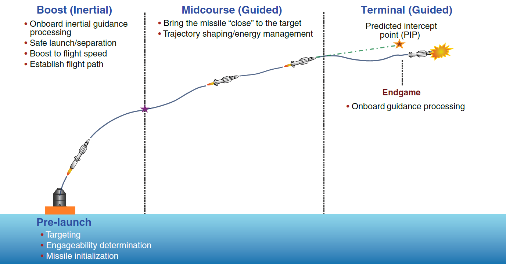
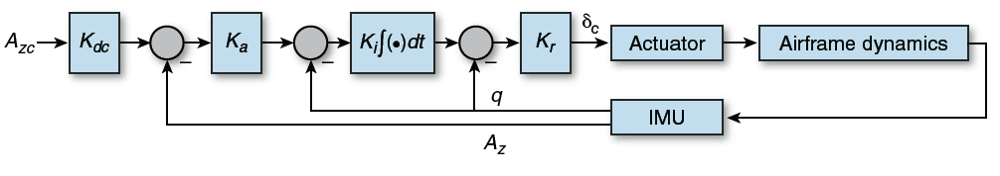

# Missile Guidance System with PID Control

This project focuses on developing a Missile Guidance System using a triple-loop PID control structure in MATLAB.  

The following image illustrates the implementation of the autopilot acceleration control system.

For mission success, the ground-to-air missile must intercept the target within a minimal distance of 5 meters and detonate.

All additional information can be obtained in the following files:

1. **Missile Orientation Control (Briefing)**, 1_report_briefing.pdf
2. **Missile Orientation Control (Theory)**, 2_report_theory.pdf
3. **Missile Orientation Control (MATLAB File)**, 3_report_matlab.pdf
4. **Simulation Report**, 4_report_simulation.pdf

**Tech Stack:** MATLAB, C, Control Theory, PID Controllers, Mathematics, Physics
